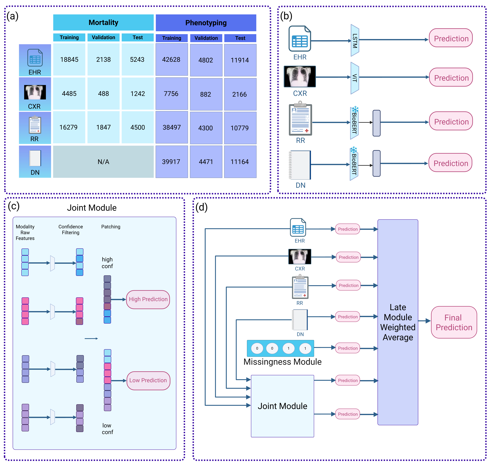

## MedPatch: Confidence-Guided Multi-Stage Fusion for Multimodal Clinical Data

Table of Contents
=================

<!--ts-->
  * [Background](#Background)
  * [Overview](#Overview)
  * [Environment Setup](#Environment-Setup)
  * [Dataset](#Dataset)
  * [Model Training](#Model-Training)
  * [Model Evaluation](#Model-Evaluation)
  * [Citation](#Citation)
<!--te-->


Background
============
Multi-modal fusion methods aim to integrate information from diverse data types. While modalities in domains such as audio-visual processing are often naturally paired and captured simultaneously, healthcare data is inherently asynchronous and heterogeneous. Clinical data—such as electronic health records (EHR), chest X-ray (CXR) images, radiology reports (RR), and discharge notes (DN)—is collected at different times and under different conditions, making full-modality availability unrealistic for clinical modeling.

To address these challenges, we propose **MedPatch**, a multi-stage fusion network designed to operate effectively under uni-modal and multi-modal conditions. MedPatch introduces a token-level confidence mechanism that partitions representations into high- and low-confidence groups, guiding fusion through a missingness-aware module. This leads to improved robustness and performance for clinical prediction tasks such as **in-hospital mortality** and **phenotype classification**, even when some data modalities are missing.


Overview of the MedPatch Network
====================================
We build on the MIMIC-IV and MIMIC-CXR datasets for our experiments. MedPatch is trained in two stages: (1) uni-modal pretraining of modality-specific encoders, and (2) confidence-guided multi-modal fusion. MedPatch processes input from EHR time-series, CXR images, and clinical notes (RR and DN), dynamically adapting to the available data.



 (a) Summary of dataset splits. (b) Unimodal pretraining pipeline for each modality. (c) Overview of the joint module used in our architecture. (d) Overview of the MedPatch architecture highlighting all the components including the missingness module, the joint module and its two predictions, and the final prediction returned by the late module.

Environment Setup
==================
```bash
git clone https://github.com/your-org/MedPatch.git
cd MedPatch
conda env create -f environment.yml
conda activate medpatch
```

Dataset
-------------
We use the following datasets for our experiments:

- [MIMIC-IV EHR](https://physionet.org/content/mimiciv/1.0/)
- [MIMIC-CXR](https://physionet.org/content/mimic-cxr-jpg/2.0.0/)
- [MIMIC-IV Notes](https://physionet.org/content/mimic-iv-note/2.2/) — for Radiology Reports (RR) and Discharge Notes (DN)

Please follow the [README](mimic4extract/README.md) in `mimic4extract/` for extracting and preparing the time-series EHR data. 

Before running scripts, set the `ehr_data_dir`, `cxr_data_dir`, and `notes_data_dir` in your config files.

To resize chest X-ray images:
```bash
python resize.py
```

To ensure consistent splits between CXR and EHR datasets:
```bash
python create_split.py
```

Refer to `arguments.py` for full configuration options.

Model Training
-----------------
We follow a two-stage training process.

### Stage 1: Uni-modal Encoder Pretraining
```bash
# Train Each unimodal encoder for mortality
sh ./scripts/mortality/EHR.sh
sh ./scripts/mortality/CXR.sh
sh ./scripts/mortality/RR.sh

# Train LSTM model on EHR data for phenotype task
sh ./scripts/phenotyping/EHR.sh
sh ./scripts/phenotyping/CXR.sh
sh ./scripts/phenotyping/RR.sh
sh ./scripts/phenotyping/DN.sh

### Stage 2: Confidence Predictor Training
Update `load_ehr`, `load_cxr`, `load_rr`, `load_dn` with the best checkpoints from Uni-modal Encoder Pretraining.
```bash
# in-hospital mortality Confidence Training
sh ./scripts/mortality/Confidence.sh

# phenotyping Confidence Training
sh ./scripts/phenotyping/Confidence.sh

#Optional Post-Hoc Calibration
sh ./scripts/mortality/Calibrate.sh
sh ./scripts/phenotyping/Calibrate.sh


### Stage 3: MedPatch Fusion and Fine-Tuning
Update `load_ehr`, `load_cxr`, `load_rr`, `load_dn` with the best checkpoints from Confidence Pretraining.
```bash
# MedPatch for in-hospital mortality
sh ./scripts/mortality/medpatch.sh

# MedPatch for phenotype classification
sh ./scripts/phenotyping/medpatch.sh
```

Training scripts for all baseline models are provided under `scripts/`. Learning rates were selected from 10 random samples in the range [0.00001, 0.001].

Model Evaluation
------------------
Update `load_state` with the trained model path.
```bash
# Evaluate MedPatch for in-hospital mortality
sh ./scripts/mortality/evaluate.sh

# Evaluate MedPatch for phenotype classification
sh ./scripts/phenotyping/evaluate.sh
```

Citation
============
If you use this code or data for your research, please consider citing:

```
@misc{your2025medpatch,
  author = {Baraa Al Jorf, Farah E.Shamout},
  title = {MedPatch: Confidence-Guided Multi-Stage Fusion for Multimodal Clinical Data},
  year = {2025},
  url = {TBD},
  note = {Accepted at MLHC 2025}
}
